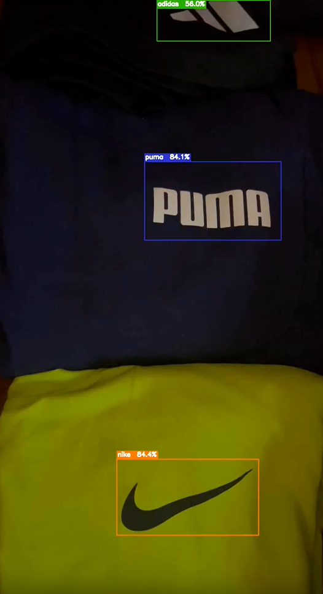
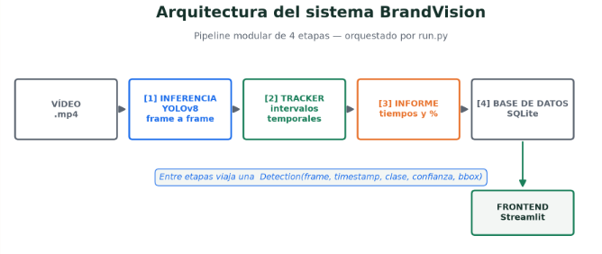
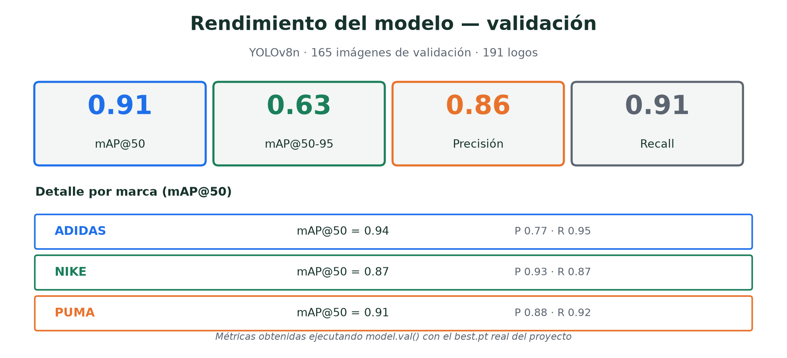
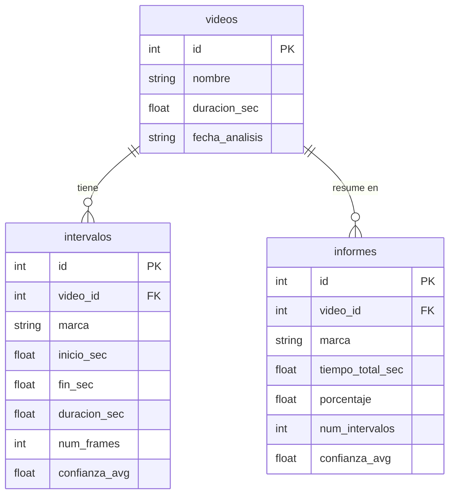

# BrandVision — Detección de marcas en vídeo

> Sistema de Computer Vision que detecta logos de marcas deportivas en vídeo, calcula el tiempo de aparición de cada una y genera un informe detallado. Desarrollado con YOLOv8 y OpenCV.


---

## ¿Qué hace este proyecto?

Una empresa de publicidad quiere saber si sus marcas realmente aparecen en pantalla — y cuánto tiempo. Sin revisión manual, sin suposiciones.

BrandVision analiza vídeos automáticamente: detecta logos de Adidas, Nike y Puma frame a frame, agrupa las apariciones en intervalos continuos y entrega un informe con tiempos exactos y porcentajes. Cada análisis queda guardado en base de datos para poder comparar campañas históricas.

El resultado: subir un vídeo, pulsar analizar, y obtener datos concretos sobre la presencia de cada marca en pantalla.

---

## Demo



> Las 3 marcas detectadas simultáneamente con bounding box y % de confianza.

[▶ Ver demo en vivo](docs/assets/04_demo_BrandVision.mp4)

---

## Arquitectura

```
P11E4/
├── app/
│   └── streamlit_app.py          # Frontend — subir vídeo y visualizar resultados
│
├── data/                         
│   └── videos/                   # (gitignored) vídeos de prueba
│
├── datasets/
│   └── brands/data.yaml          # Dataset en formato YOLO (Roboflow export)
│
├── models/                       # (gitignored) pesos del modelo best.pt
│
├── outputs/                      # (gitignored) vídeos anotados, informes, BD
│
├── src/
│   ├── config.py                 # Rutas y constantes centralizadas
│   ├── run.py                    # Punto de entrada principal
│   ├── training/train.py         # Entrenamiento YOLOv8 + data augmentation
│   ├── detection/
│   │   ├── video_pipeline.py     # Inferencia frame a frame con OpenCV
│   │   └── tracker.py            # Agrupación de detecciones en intervalos
│   ├── reporting/report.py       # Cálculo de tiempos, % e informes
│   └── database/
│       ├── schema.sql            # Esquema SQLite
│       └── db.py                 # Inicialización y funciones de acceso
│
├── tests/
│   ├── test_db.py                
│   ├── test_report.py                
│   └── test_tracker.py
│
├── docs/
│   ├── assets/                   # Imagenes
│   ├── briefing/                 # Report técnico
│   └── slides/                   # Presentación
│
├── tools/
│   ├── issues_to_md.py             
│   ├── mapa_urls.py        
│
├── pyproject.toml
│       
└── README.md
```

### Flujo del sistema

Pipeline modular de 4 etapas orquestado por `run.py`. Entre etapas viaja una estructura `Detection(frame, timestamp, clase, confianza, bbox)`.



---

## Tecnologías

| Área | Tecnología |
|---|---|
| Modelo | YOLOv8n (Ultralytics) — transfer learning |
| Etiquetado | Roboflow |
| Procesado de vídeo | OpenCV |
| Base de datos | SQLite + sqlite3 |
| Frontend | Streamlit |
| Entorno | Python 3.11 + uv |

---

## Métricas del modelo

YOLOv8n entrenado con transfer learning sobre pesos preentrenados. Dataset propio etiquetado en Roboflow. Hiperparámetros: 50 épocas, imagen 640px, batch 16, early stopping (patience 20). Data augmentation: volteo horizontal, rotación, variación HSV y mosaic.

Validación sobre **165 imágenes** (191 logos), umbral de confianza 0.40:

| Métrica | Valor |
|---|---|
| mAP@50 | 0.91 |
| mAP@50-95 | 0.63 |
| Precisión | 0.86 |
| Recall | 0.91 |

**Detalle por marca (mAP@50):**

| Marca | mAP@50 | Precisión | Recall |
|---|---|---|---|
| Adidas | 0.94 | 0.77 | 0.95 |
| Puma | 0.91 | 0.88 | 0.92 |
| Nike | 0.87 | 0.93 | 0.87 |



---

## Instalación

### Requisitos previos

- Python 3.11
- [uv](https://github.com/astral-sh/uv)
- `best.pt` — solicitar al equipo (gitignored, compartido por Discord)
- **ffmpeg** — necesario para reproducir el vídeo anotado en el frontend

### Con uv (recomendado)

```bash
git clone https://github.com/tu-org/P11E4.git
cd P11E4

# Instala dependencias y crea el entorno virtual
uv sync

# Coloca el modelo entrenado
cp best.pt models/best.pt
```

### Instalar ffmpeg (necesario para el frontend)

**Windows:**
```powershell
winget install ffmpeg
```

Después de instalar, obtén la ruta exacta con:
```powershell
Get-Command ffmpeg | Select-Object -ExpandProperty Source
```

Si `shutil.which("ffmpeg")` no la detecta automáticamente, actualiza `ffmpeg_path` en `app/streamlit_app.py` con esa ruta.

**macOS:**
```bash
brew install ffmpeg
```

**Linux:**
```bash
sudo apt install ffmpeg
```

### Despliegue con ngrok (demo pública)

Para compartir la app temporalmente sin servidor:

```bash
# 1. Arranca Streamlit en local
uv run streamlit run app/streamlit_app.py

# 2. En otra terminal, expón el puerto con ngrok
ngrok http 8501
```

ngrok genera una URL pública temporal (`https://magical-giving-starved.ngrok-free.dev/`) que puedes compartir para la demo. Ten en cuenta que la URL cambia cada vez que reinicias ngrok en el plan gratuito.

---

## Uso

### Pipeline completo (línea de comandos)

```bash
# Analizar un vídeo y generar informe
uv run python src/run.py data/videos/mi_video.mp4

# Sin guardar vídeo anotado (más rápido)
uv run python src/run.py data/videos/mi_video.mp4 --no-video

# Ajustar umbral de confianza y frame skip
uv run python src/run.py data/videos/mi_video.mp4 --conf 0.5 --skip 2
```

**Salidas generadas en `outputs/`:**
- `mi_video_annotated.mp4` — vídeo con bounding boxes y confianza
- `mi_video_report.json` — informe estructurado para el frontend
- `mi_video_report.txt` — informe legible
- `detecciones.db` — base de datos SQLite con el historial

### Frontend Streamlit

```bash
uv run streamlit run app/streamlit_app.py
```

Abre `http://localhost:8501`, sube un vídeo y pulsa **Analizar**.

### Test rápido sin vídeo

```bash
uv run python src/reporting/report.py
```

---

## Ejemplo de informe

```
============================================================
  INFORME DE DETECCIÓN DE MARCAS
============================================================
  Vídeo      : test_1brands
  Duración   : 00:15.2
  Generado   : 2026-06-24T07:51:32Z
============================================================

  ADIDAS
    Tiempo total  : 00:15.1  (99.3%)
    Apariciones   : 1
    Conf. media   : 76.3%
    [█████████████████████████████░] 99.3%

  PUMA
    Tiempo total  : 00:13.5  (88.8%)
    Apariciones   : 2
    Conf. media   : 75.5%
    [██████████████████████████░░░░] 88.8%

  NIKE
    Tiempo total  : 00:11.9  (78.7%)
    Apariciones   : 2
    Conf. media   : 73.8%
    [███████████████████████░░░░░░░] 78.7%
============================================================
```

---

## Estructura de la base de datos

Tres tablas: un vídeo tiene muchos intervalos de aparición y un resumen por marca. Cada análisis se persiste completo, lo que permite consultar y comparar campañas históricas.



---

## Notas sobre archivos gitignored

| Archivo | Dónde va | Cómo obtenerlo |
|---|---|---|
| `best.pt` | `models/best.pt` | Discord del equipo |
| Vídeos de prueba | `data/videos/` | Discord del equipo |

---

## Equipo — Byte Lab

| Persona | Rol | GitHub |
|---|---|---|
| Camila Arenas | Dataset & Entrenamiento & Presentación | [@mcarenashd](https://github.com/mcarenashd) |
| Iris Fernanda Amorim | Pipeline de vídeo & Reporting & Documentación | [@IrisFernandaAmorim](https://github.com/IrisFernandaAmorim) |
| Raúl Machaca | Base de datos & Tests & Integración backend-frontend | [@RaulCtm](https://github.com/RaulCtm) |
| Jose-Julio Ramírez y Sánchez-Escobar | Frontend Streamlit & Setup inicial & Documentación | [@Jose-JulioRamirezySanchez-Escobar](https://github.com/Jose-JulioRamirezySanchez-Escobar) |

---

---

*Proyecto académico desarrollado en el Bootcamp de IA & Data Science de [Factoría F5](https://factoriaf5.org/) · Madrid, junio 2026.*
